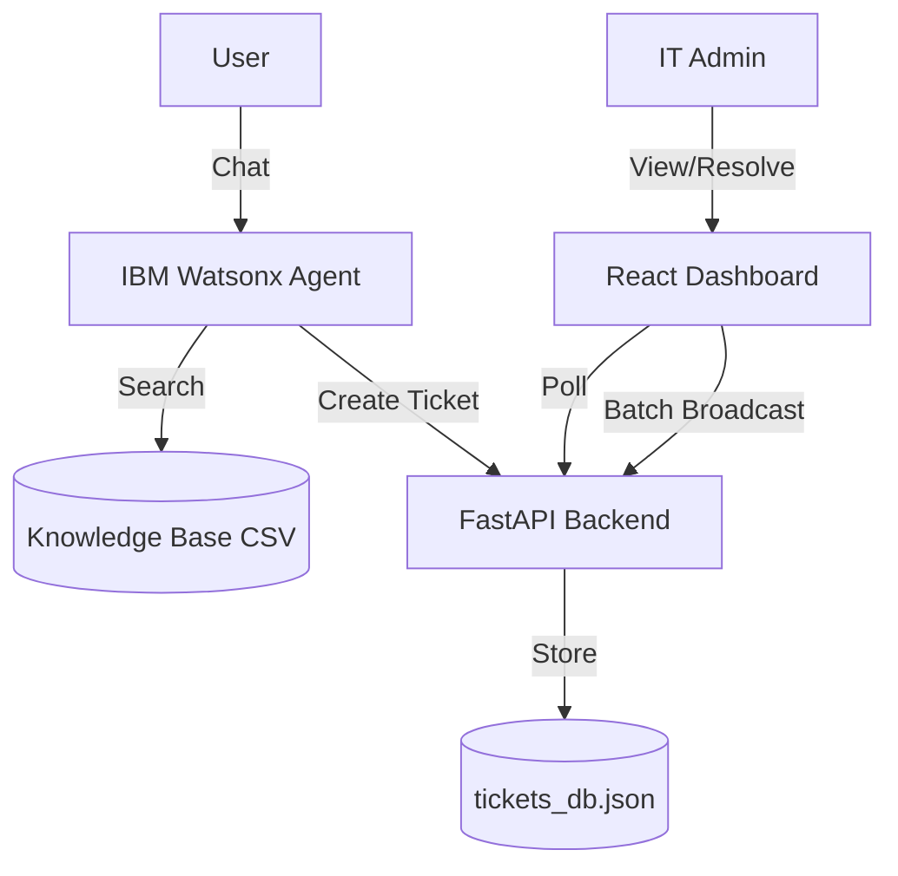

# LoopBack AI - Enterprise IT Support Assistant 🚀


> **Winner of "Best Agentic Workflow" Candidate - IBM Hackathon 2026**
>
> An intelligent, Human-in-the-Loop IT support system powered by **IBM Watsonx Orchestrate**. It combines AI-driven knowledge retrieval, self-healing database logic, and a modern dashboard for seamless IT operations.

---

## 🌟 Key Features

### 🧠 Intelligent Agent (Watsonx)
- **Smart Categorization**: Automatically routes tickets to *Network, Hardware, Software, Account* based on context.
- **Draft Generation**: Pre-writes empathetic admin responses using GenAI.
- **Knowledge Retrieval**: Searches internal CSV database to answer queries instantly.

### 🖥️ Modern Dashboard (React 18)
- **Live Knowledge Base View**: 🆕 Browse the full 40+ item `Workplace_IT_Support_Database.csv` directly in the UI.
- **Batch Operations**: 🆕 Select multiple tickets and "Broadcast" a single solution to all of them.
- **Real-time Filtering**: Filter by Status, Category, and Subcategory instantly.
- **Dark Mode UI**: Sleek, glassmorphism-inspired design for reduced eye strain.

### 🛠️ Robust Backend (FastAPI)
- **Self-Healing Database**: Automatic integrity checks (`fix_db.py`) ensure no duplicate IDs or missing fields.
- **Sequential IDs**: Clean Ticket IDs (e.g., `TKT-1001`, `TKT-1002`).
- **RESTful API**: Fully documented endpoints for Tickets, Knowledge Base, and Agent interactions.

---

## 🏗️ Architecture



---

## 🚀 Quick Start

### 1. Backend Setup
```bash
# Clone and Enter
git clone https://github.com/SHIRONEKO1121/LoopBack.git
cd LoopBack

# Install Dependencies
pip install -r requirements.txt

# Run Server (Port 8000)
python server.py
```

### 2. Frontend Setup
```bash
cd frontend

# Install Dependencies
npm install

# Start Dev Server (Port 5173)
npm run dev
```

### 3. Agent Integration (ngrok)
```bash
# Expose Backend to IBM Cloud
ngrok http 8000
```
*Copy the ngrok URL and update your `loopback_openapi.json` before importing to IBM Orchestrate.*

---

## 📂 Project Structure

- `server.py`: Main FastAPI entry point.
- `tickets_db.json`: JSON-based storage for active tickets.
- `knowledge_base/`: Contains the `Workplace_IT_Support_Database.csv`.
- `frontend/`: React application source code.
    - `src/DatabaseViewer.jsx`: **New** Component for viewing KB CSV.
    - `src/App.jsx`: Main dashboard logic.
- `fix_db.py`: Utility script to repair database structure.

---

## 📸 Screenshots

| Dashboard View | Knowledge Base View |
|:---:|:---:|
| *Manage tickets with ease* | *Browse static KB articles* |
| (Add screenshot here) | (Add screenshot here) |

---

## 🤖 API Documentation

| Endpoint | Method | Description |
|----------|--------|-------------|
| `/tickets` | GET | List all active tickets |
| `/tickets` | POST | Create a new ticket |
| `/knowledge-base` | GET | **New** Fetch full CSV content |
| `/broadcast_all` | POST | Resolve multiple tickets at once |

---

## 💿 Database Management

If you encounter duplicate IDs or missing categories, run the self-healing script:

```bash
python fix_db.py
```
This will:
1. Re-index all tickets (TKT-1001+)
2. Assign categories based on keywords
3. Clean up any corrupted data

---

## 👥 Team

**Developer**: [SHIRONEKO1121](https://github.com/SHIRONEKO1121)

*Built for IBM Watsonx 2026*
